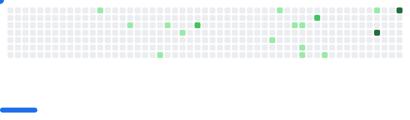

###  A little more about me...

```jsx
const tinspham = {
  pronouns: "He" | "Him",
  name: "Tin, Pham Van",
  location: "Da Nang city, Vietnam",
  language: ["Vietnamese", "English"],
  working: [
    {
	  company: "ONE Tech Stop",
      website: "www.ots.one-line.com",
      title: "Full-Stack Developer",
      team: "Design System",
      time: "Jun/2025 - Present"
    },
    {
      company: "DataHouse",
      website: "www.datahouse.com",
      title: "Software Engineering",
      team: ["VizPlatform", "LumiSight"],
      time: "Jul/2021 - May/2025"
    }
  ],
  education: {
    major: "Bachelor of Software Engineering",
    location: "Duy Tan University",
    time: "2017 - 2021"
  }
};
```

### Connect with me:

<p>
	<a href="https://tinspham.dev/" target="_blank">
		
	</a>
	<a href="https://www.linkedin.com/in/phamvantins/" target="_blank">
		
	</a>
	<a href="mailto:tinphamvan123@gmail.com">
		
	</a>
</p>

### Open Source Work Stats:
<a href="https://tinspham.dev" target="_blank" rel="noopener noreferrer">
	
</a>

<picture>
  <source
    media="(prefers-color-scheme: dark)"
    srcset="images/breakout-dark.svg"
  />
  <source
    media="(prefers-color-scheme: light)"
    srcset="images/breakout-light.svg"
  />
  
</picture>
